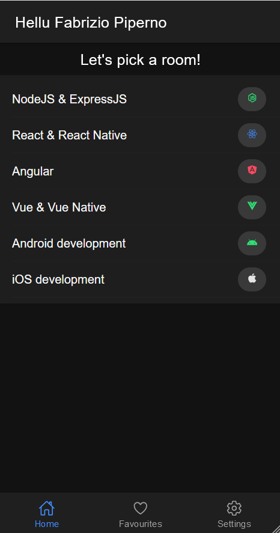
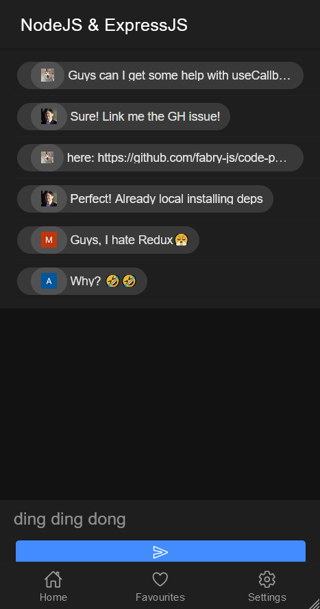

# Code Penguins - The fun of dev chatting in your pocket!

   

> _Code Penguins is the fun of dev chatting and sharing passion and tips together, in your pocket!_

Hello Penguins of GitHub! Thanks for passing by and seeing my work on this project. Here are some screenshots of the app!

Yeah, that's the Home Page Mr.Penguin, here you can choose among a lot of rooms (igloos) and enter in the one you like the most!

Aaand That's the NodeJS Room, _those guys might've mistaken it for React dev room_ 😕

That's all for now! Thanks for reading!

***Happy Coding ✨***

_@fabry-js_
